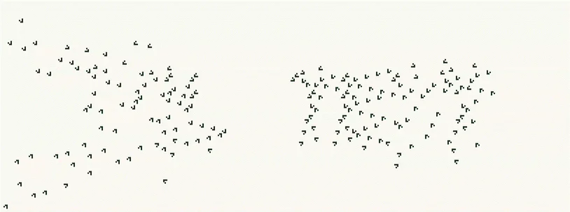

# game-of-life-text

Type a word, and it gets built out of colliding gliders in Conway's Game of
Life. Two gliders per pixel, aimed and delayed so nothing interferes, and the
whole thing settles into still-life blocks that spell what you typed.

Runs as a PySide6 desktop app, or in the browser at
[conway.martinsundal.no](https://conway.martinsundal.no/).



## Desktop app

Needs Python 3.14 (pinned in `.python-version`) and
[uv](https://docs.astral.sh/uv/).

```bash
uv sync
uv run gol-gui
```

Type text, hit `Generate`, then run the board until the settle bar fills. The
`Text` and `Board` toggles switch between the finished text and the glider seed;
`Randomize` and `Blank` give you a sandbox to draw in instead.

## Browser app

The canvas and the simulation loop are TypeScript. The planner is the same
Python package, running in a Pyodide worker — the first visit downloads the
WebAssembly runtime and NumPy, then caches them. The first word then builds
itself and stops on the generation it settles.

```bash
mise run web    # builds dist/ and serves it on :8000
```

Keyboard: `space` run/pause, `s` step, `r` reset, `t` target/board, `d` draw,
`g` ghost, `f` fit, `+`/`-` zoom. Drag pans, the wheel zooms. `export .rle`
writes the pattern in RLE, so it opens in Golly or LifeViewer.

The page follows the system light or dark setting; the switch in the header
overrides it and is remembered. Both palettes live in `web/styles.css`, which
is also where the canvas reads its colours from.

## How it works

The renderer turns glyph pixels into 2x2 blocks. The planner walks those blocks
outward from the center, and for each one picks a two-glider synthesis whose
launch direction and delay keep its gliders clear of every block already placed
and of the blocks still to come. Constructions are verified by simulation before
anything is shown.

## Layout

| Path                    | What it is                                         |
| ----------------------- | -------------------------------------------------- |
| `src/game_of_life_text` | Simulator, font, planner, GUI, browser bridge      |
| `web/`                  | Browser app: TypeScript, HTML, stylesheet, webfont |
| `scripts/build_web.py`  | Stages `dist/`; `tsc` compiles into it             |
| `tests/`                | pytest for Python, vitest under `tests/web`        |

## Development

```bash
mise run check      # everything below, in one go
mise run test       # pytest
mise run test:web   # vitest
mise run lint       # ruff check + ruff format --check
mise run lint:web   # eslint + prettier + markdownlint
mise run typecheck  # ty
mise run build      # dist/
```

Without mise: `uv run pytest`, `uv run ruff check`, `uv run ty check`,
`npm test`, `npm run typecheck`, `npm run lint`, `npm run build`.

CI runs the Python and web checks on every push. Pushing to `main` deploys
`dist/` to GitHub Pages.

## License

MIT
